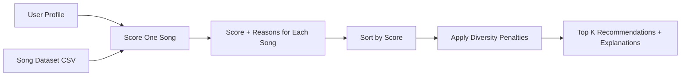

# 🎵 Music Recommender Simulation

## Project Summary

This project implements a CLI-first, content-based music recommender that converts a user's taste profile into ranked song suggestions with transparent reasoning. The system uses a structured catalog in `data/songs.csv`, computes weighted relevance scores in `src/recommender.py`, and prints interpretable recommendations for multiple user profiles in `src/main.py`.

## How Real Recommendation Systems Work

Real platforms (Spotify, YouTube, TikTok) often combine two ideas:

1. Collaborative filtering: learn from behavior patterns across many users (likes, skips, completions, playlists, watch time).
2. Content-based filtering: match item attributes (genre, mood, tempo, energy, embeddings) to a specific user's historical taste.

This simulation focuses on content-based recommendation, where:

- Input data = measurable song attributes from the dataset.
- User preferences = target values and priorities (genre, mood, energy, tempo, etc.).
- Ranking/selection = score each song, then sort/select top-k results.

This distinction mirrors basic ML literacy: features enter the model, preferences define objective fit, and ranking transforms raw scores into final predictions.

## How This System Works

### Data Features Used

Each song includes:

- Core features: `genre`, `mood`, `energy`, `tempo_bpm`, `valence`, `danceability`, `acousticness`
- Extra stretch features: `popularity`, `release_decade`, `instrumentalness`, `loudness_db`, `liveness`, `mood_tags`

### User Profile Stores

Each profile includes:

- Taste targets: genre, mood, energy, tempo, valence, danceability, acousticness
- Extra preferences: popularity preference, release decade, mood tags
- Ranking controls: scoring mode, artist diversity penalty, genre diversity penalty

### Algorithm Recipe

For each song:

1. Add weighted points for exact categorical matches (`genre`, `mood`).
2. Add similarity points for continuous features (energy, tempo, valence, danceability, acousticness, popularity, era proximity).
3. Add tag bonuses for overlapping `mood_tags`.
4. Keep a human-readable `reasons` list explaining point contributions.

Then rank songs by score and apply diversity-aware selection:

- Penalize repeated artists in the selected top-k list.
- Penalize repeated genres in the selected top-k list.

This reduces filter bubbles and improves variety.

### Ranking Modes (Stretch)

Implemented modes:

- `balanced`
- `genre_first`
- `mood_first`
- `energy_similarity`

Switch mode in CLI:

```bash
python -m src.main --mode balanced
python -m src.main --mode genre_first
python -m src.main --mode energy_similarity
```

### Data Flow



## Getting Started

### Setup

```bash
python -m venv .venv
.venv\Scripts\activate
pip install -r requirements.txt
```

### Run

```bash
python -m src.main --mode balanced
```

### Tests

```bash
python -m pytest
```

## Terminal Output Evidence (Top Recommendations)

Below are captured terminal outputs used in place of screenshots.

### Profile 1: High-Energy EDM Fan (`balanced`)

Top 3 were:

1. Festival Circuit (edm)
2. Runway Heat (edm)
3. Gym Hero (pop)

Reason pattern:

- Strong `genre` + `mood` + high energy/tempo fit.
- Second EDM track received a small genre diversity penalty.

### Profile 2: Chill Acoustic Listener (`balanced`)

Top 3 were:

1. Golden Hour Strings (acoustic)
2. Sunday Vinyl (acoustic)
3. Quiet Pines (folk)

Reason pattern:

- Very strong acousticness and calm-energy matches.
- A second acoustic song is still selected, but slightly penalized for repetition.

### Profile 3: Hip-Hop Focus Profile (`balanced`)

Top 3 were:

1. Concrete Verse (hip-hop)
2. Basement Cipher (hip-hop)
3. Glitch Sprint (electronic)

Reason pattern:

- Hip-hop/focused profile prioritizes genre + mood + danceability alignment.
- Third pick shows controlled exploration outside genre while preserving energy fit.

## Explanations for Recommended Songs

Examples of explanation strings returned by the system:

- `Festival Circuit`: genre match, mood match, energy similarity, tempo similarity, tag match (`festival`, `hype`, `night`).
- `Golden Hour Strings`: genre + mood match, high acousticness similarity, calm tempo/energy alignment.
- `Concrete Verse`: genre + mood match, danceability + focus tag overlap (`flow`, `focus`, `grit`).

These explanations are generated directly from the scoring function logic.

## Experiments and Findings

### Experiment A: Multiple Ranking Modes

Compared `balanced`, `genre_first`, and `energy_similarity`.

- In `genre_first`, matching genre dominates more strongly.
- In `energy_similarity`, high-energy tracks rise even if genre differs.
- `balanced` produced the most intuitive tradeoff between category match and numeric similarity.

### Experiment B: Diversity/Fairness Penalty

Artist and genre penalties were enabled in top-k selection.

- Prevented repeated artist/genre from fully dominating results.
- Reduced simple filter-bubble behavior while keeping relevant songs near the top.

## Differences Between User Profiles

Observed profile shifts:

- EDM profile gravitates toward high energy + higher BPM + festival/hype tags.
- Acoustic profile shifts toward low-energy, high-acousticness, calm mood tracks.
- Hip-hop profile emphasizes danceability, focus mood, and modern rhythmic tracks.

This confirms the recommender is sensitive to profile changes rather than producing static results.

## Limitations and Risks

- Dataset is still small (22 songs), so long-tail behavior is limited.
- No collaborative signal (no shared user history), only content features.
- Tag vocabulary is manually authored and may encode subjective bias.
- Audio attributes are simplified proxies and not full embeddings.

## Reflection

Building this simulation made it clear that recommendations are not magic; they are structured transformations from features to scores to rankings. Even a simple weighted model can feel personalized when the features align with user taste.

The biggest lesson was how quickly bias can appear through design choices. If one feature weight is too high, recommendations collapse into a narrow bubble. Adding explicit diversity penalties and multiple ranking modes made the system more transparent and fairer while still maintaining relevance.

## Model Card

See the completed model card in [model_card.md](model_card.md).

